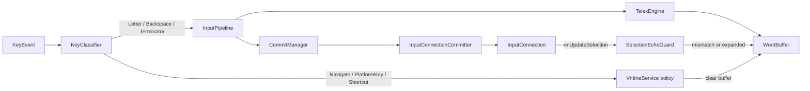

# Architecture

VN Telex HW is an `InputMethodService` that turns hardware key events into Vietnamese Telex
text without IME composition. Every intermediate or final syllable is written with
replace-before-cursor + `commitText`.

## Data flow

## Components

| Class | Role |
|-------|------|
| `VnImeService` | IME entry: classify keys, track expected caret, clear buffer on Navigate / bad selection |
| `KeyClassifier` | Maps keyCode + meta + unicode → `KeyAction` |
| `InputPipeline` | Letter / backspace / terminator → Telex + commit |
| `TelexEngine` | Pure Telex conversion (no Android APIs) |
| `WordBuffer` | Current raw word, display text, `committedLength` |
| `CommitManager` | Batches edits; replaces `committedLength` chars then commits |
| `InputConnectionCommitter` | Selection replace → deleteSurrounding → synthetic DEL |
| `SelectionEchoGuard` | Distinguishes self-edit echoes from real caret moves |

## No composition

The IME does not call `setComposingText` or keep a composing region. Editors that break on
composition (Lark Web and similar) see normal committed text updates.

## WordBuffer and `committedLength`

While you type a word, the engine may change the syllable length (`a` → `â`, `uw` → `ư`).
`committedLength` is how many characters currently sit in the editor for that word.
`CommitManager` asks the committer to replace that many characters before the caret with the
new string, then updates `committedLength`.

Terminators (space, punctuation) flush the word and clear the buffer. An empty buffer on
Backspace returns `false` so the platform deletes in the editor.

## Replace path (`InputConnectionCommitter`)

1. Prefer `setSelection(start, cursor)` + `commitText` (works better in Chrome).
2. Fall back to `deleteSurroundingText` + `commitText`.
3. If delete is a no-op, send `KEYCODE_DEL` key events, then commit.

## Buffer clear policy

Clear the in-progress Telex word when:

- **Navigate:** DPAD, Page Up/Down, Home, End, Escape, Forward Delete (`return false` after clear)
- **Selection:** non-collapsed selection, or collapsed caret that does not match `expectedCursor` after our edit
- **Terminator / Switch IME / finish input:** as implemented in `VnImeService`

`SelectionEchoGuard` credits a few selection callbacks after self-edits. Credit only
suppresses clears when the caret still matches the expected position. A mismatched caret
clears the buffer.

## Soft input view

`onCreateInputView` returns a blank `View`. The product targets hardware keyboards only.
